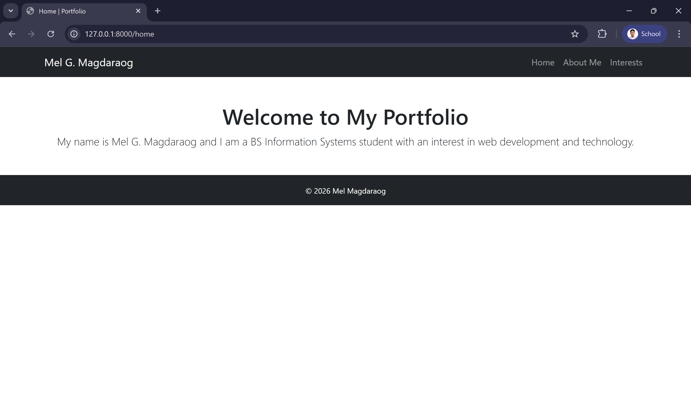
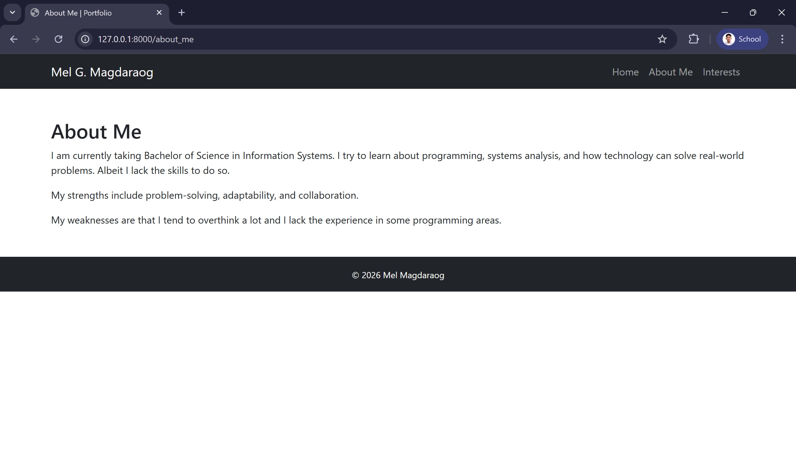
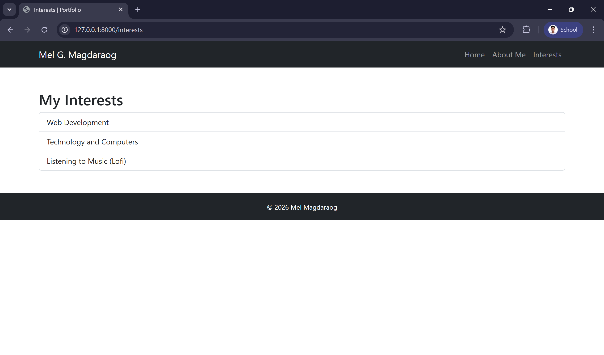

# Laravel Portfolio – Laboratory 3

## Project Description
This project is a simple multi-page portfolio web application developed using Laravel.  
It was created as part of **Laboratory 3** to demonstrate the basics of Laravel installation, routing, controllers, and Blade templates.

The application consists of one main portfolio page and two additional sub-pages, styled using Bootstrap.

---

## Pages Included
- Home
- About Me
- Interests

---

## Screenshots

### Home Page


### About Me Page


### Interests Page


---

## How to Run the Project Locally

1. Clone the repository:
   ```bash
   git clone <your-github-repository-link>

2. Navigate to the project directory:
    `cd your-project-folder`

3. Install dependencies:
    `composer install`

4. Run the Laravel development server:
    `php artisan serve`

5. Open a browser and visit:

`http://127.0.0.1:8000/home`

`http://127.0.0.1:8000/about_me`

`http://127.0.0.1:8000/interests`

# Author
## Mel G. Magdaraog
## BSIS-2

